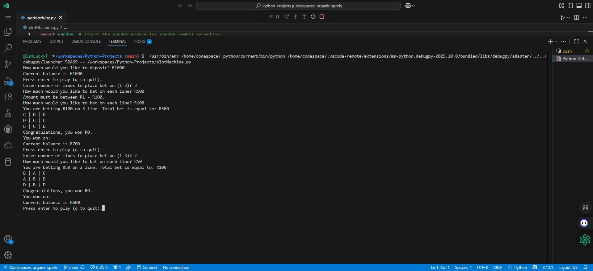
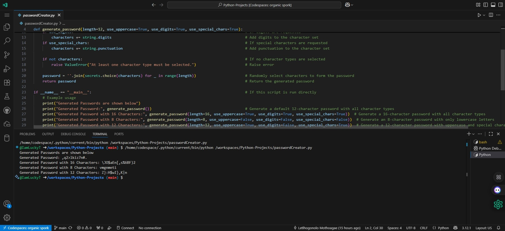

The slotMachine.py is a program that is a slot machine game where the user inputs the amount they want to deposit, choose on which line (line 1, 2 or 3) and they select their bet amount.
The output is whether the bet won or not and it will dispaly the machine draw and if it won a congratulations message will appear with the amount they won on the bet.
Below is the terminal output for the slot machine project.

The passwordCreator.py is a program that randomly generates a password for you, where the password is generated in the following format (length=12, use_uppercase=True, use_digits=True, use_special_chars=True) for the first output, 
second output is in this format (length=16, use_uppercase=True, use_digits=True, use_special_chars=True), third output (length=8, use_uppercase=False, use_digits=False, use_special_chars=False).
Below is the terminal output for the password generator project.

